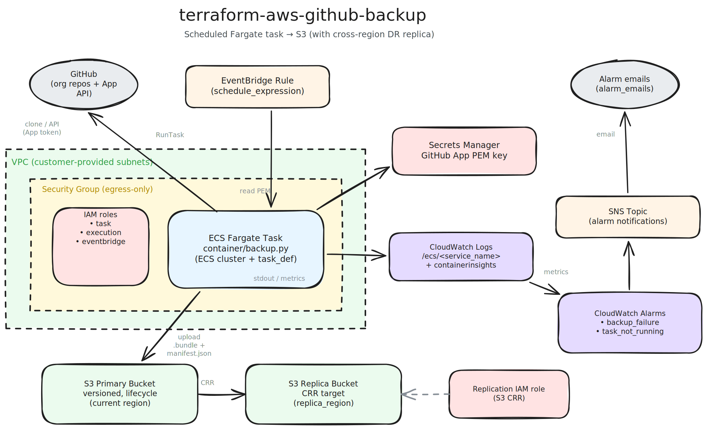

# terraform-aws-github-backup

A Terraform module that backs up all repositories in a GitHub organization to S3 using an ECS Fargate
scheduled task. Designed to be deployed by the customer in their own AWS account with zero operational
dependency on InfraHouse.

## Features

- **ECS Fargate scheduled task** — no always-on compute, no Lambda timeout limits; you pay only for
  the backup window
- **Customer-owned GitHub App** — no shared credentials, short-lived installation tokens only
- **S3 with versioning** and configurable lifecycle for retention
- **Cross-region S3 replication** — disaster recovery via AWS provider v6 per-resource regions (no
  aliased providers)
- **CloudWatch Logs + Container Insights** with configurable retention
- **CloudWatch Alarms** for `BackupFailure` and `task_not_running`, surfaced through SNS → email
- **Least-privilege IAM roles** (task, execution, eventbridge, replication)
- **`git bundle`** format — full, portable, self-contained mirrors that don't need GitHub to restore

## Quick Start

> **Note:** Check the [Terraform Registry](https://registry.terraform.io/modules/infrahouse/github-backup/aws/latest)
> or [GitHub Releases](https://github.com/infrahouse/terraform-aws-github-backup/releases) for the
> latest version.

```hcl
module "github_backup" {
  source  = "registry.infrahouse.com/infrahouse/github-backup/aws"
  version = "2.0.2"

  github_app_id              = "123456"
  github_app_installation_id = "78901234"

  alarm_emails                  = ["devops@example.com"]
  github_app_key_secret_writers = [aws_iam_role.deployer.arn]
  replica_region                = "us-east-1"
  subnets                       = ["subnet-abc123", "subnet-def456"]
}
```

This creates:

- An ECS Fargate cluster named `github-backup` with Container Insights enabled
- An EventBridge rule that runs the backup task on a schedule (default: daily)
- A versioned S3 primary bucket with a cross-region replica in `replica_region`
- A Secrets Manager secret to hold the GitHub App private key (PEM)
- CloudWatch log groups, alarms, and an SNS topic wired to `alarm_emails`

After `terraform apply`, you must write the GitHub App PEM into the Secrets Manager secret whose ARN
is published as the `github_app_key_secret_arn` output. See [Getting Started](getting-started.md).

## Architecture



The module deploys:

1. **EventBridge Rule** — fires on `schedule_expression` and invokes ECS `RunTask`
2. **ECS Fargate Task** (`container/backup.py`) — reads the GitHub App PEM, mints a JWT, exchanges
   it for an installation token, lists repos, and `git clone --mirror`s each one
3. **S3 Primary Bucket** — stores `.bundle` files plus a dated `manifest.json`
4. **S3 Replica Bucket** — cross-region copy via S3 Replication
5. **CloudWatch Logs** — task stdout and Container Insights performance metrics
6. **CloudWatch Alarms + SNS** — email alerts on backup failure or missed runs

See [Architecture](architecture.md) for details, DR posture, and design rationale.

## Requirements

| Name | Version |
|------|---------|
| terraform | ~> 1.5 |
| aws | ~> 6.0 |

## Next Steps

- [Getting Started](getting-started.md) — prerequisites, first deployment, storing the GitHub App key
- [Configuration](configuration.md) — all variables with examples
- [Architecture](architecture.md) — component walkthrough, RPO/RTO, design decisions
- [Troubleshooting](troubleshooting.md) — failure scenarios and restore procedures
